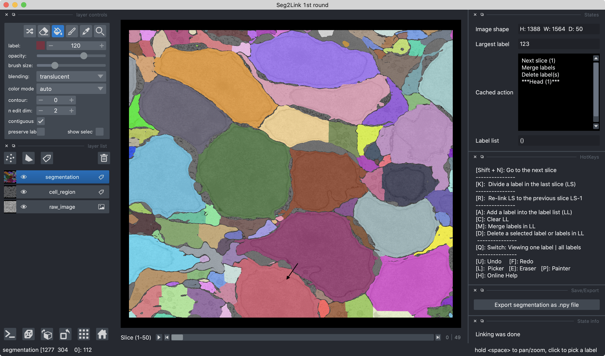
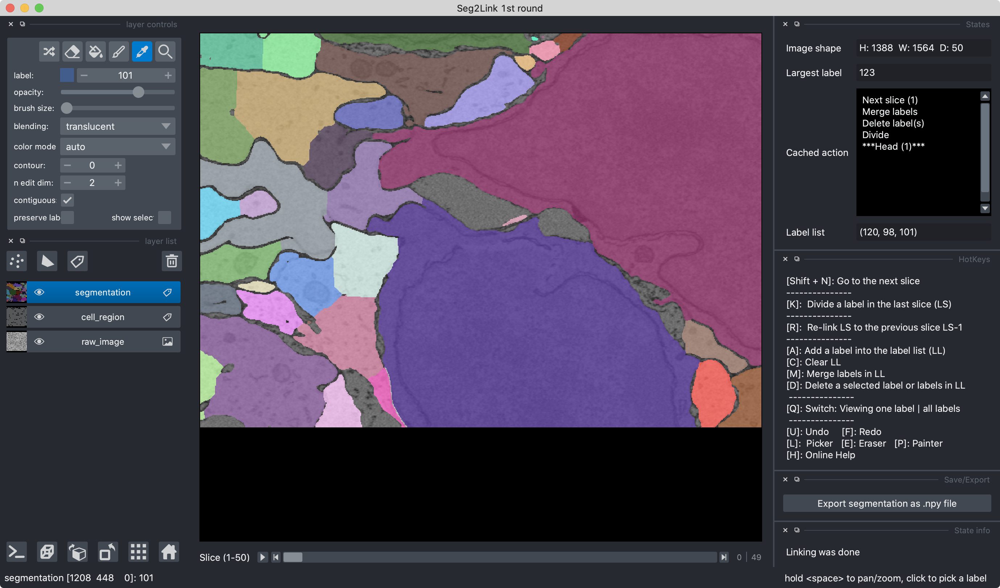

# Help information for the first round: Seg2D + Link

## How to start the first round

1. Start Seg2Link from terminal
   
   

2. Choose the first round and set the parameters
   
   
   
   

3. Start the first round
   
   

## Workflow in the first round

1. Correct the segmentation in slice **1**
2. Go to the next slice **i** (Press **Shift + N**)
3. Correct the segmentation in slice **i**
4. Repeat 2 and 3 until all slices are segmented
5. Export the segmentation as a .npy file (Press the Export button)

## Commands:

### Actions that can be cached for undo/redo

### 1. *Merge*

1. Click a cell in **Pick Mode** to select it, and then press **A** to add the selected cell into the label list (Shown in the "states" panel).
   
   
2. Repeat step 1 to add more cells. 
   
   
3. Press **M** to merge the cells in the label list
   
   
   
   ```
   Note:
   - To clear the label list, press C.
   ```

### 2. *Delete*

1. Select a cell in **Pick Mode**. Or alternatively, add multiple cells into the label list (See explanations in **Merge** section)
   
   
2. Press D to delete the selected cell (or multiple cells in the label list)
   
   

# 

### 3. *Division*

1. Select a cell in **Pick Mode** in the last slice i
   
   

2. If necessary, zoom in (**Space + Mouse scroll wheel**) and edit the cell boundary with the tool **Eraser**.
   
   

3. Press **K** to divide the cell in the slice i into multiple cells. 
   
   

4. If neccesary, use other commands such as **Merge** and **Delete** to further modify the result.
   
   

```
Notes:
- Division command should only be used in the last slice segmented. 
Apply it in previous slices is unsupported.
- The division will generate new cells which may require linkings.
```

### 4. *Next slice*

Press ****Shift + N**** to segment the next slice *i+1* and link the segmentation to previous slices {*1, 2, 3, ..., i* }

### 5. *Re-Link*

1. Move to the last slice *i* that has been segmented.
2. Modify the segmentation in slice *i*
3. Press **R** to link the modifed segmentation in slice *i* to the previous slices
   
   ```
   Notes: 
   - Users can modify the segmentation in slice i with the commands
   "Division"/"Merge"/"Delete", or with the napari tools "Eraser"/"Painter".
   - Do not modify slices before i, which is not supported in round #1.
   ```

### Undo/Redo cached actions:

### 1. *Undo*

Press U to undo one action shown in the "Cached actions" panel

### 2. *Redo*

Press F to redo one action shown in the "Cached actions" panel 

### Export the segmentation (.npy) for the second round

1. Press the "Select file" button to open a dialog box
2. Change the directory, edit the filename, and press the "Save" button to close the dialog box
3. Press the "Export(.npy)" button to export the segmentation result
