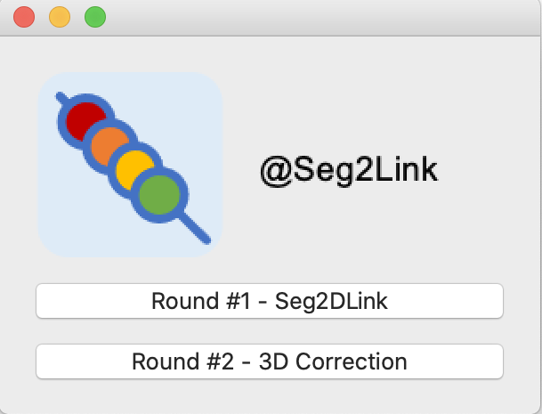

# Help information for the first round: Seg2D + Link

## How to start the first round
1. Start Seg2Link from terminal
   
   
2. Choose the first round and set the parameters
   
   
   
   
3. Start the first round
   
   
   
## Workflow in the first round
1. Correct the segmentation in slice **1**
2. Go to the next slice **i** (Press **Shift + N**)
3. Correct the segmentation in slice **i**
4. Repeat 2 and 3 until all slices are segmented
5. Export the segmentation as a .npy file (Press the Export button)

## Commands:
### *Next slice:*
Press Shift + N to segment the next slice **i+1** 
and link it to slice **i**

### *Re-Link:*
1. Move to the last slice
2. Select a cell in Pick Mode (press L)
3. Modify the selected cell region with eraser, bucket, and paint brush tools
4. Press R to re-segment the last slice. The segmentation will be linked with the previous slices

### *Divide a cell*
1. Do the same thing as in 1-3 in **Re-segmentation**
2. Press K to divide the cell in the last slice. The division will not be linked with the previous slices

### *Merge:*

1. Select a cell in Pick Mode
2. Add the selected cell into the merge list by pressing A
3. Repeat (1) and (2) to add more cells. To clear the merge list, press C
5. Press M to merge all cells in the merge list

### *Delete:*

1. Select a cell in Pick Mode
2. Press D to remove the selected cell

### *Undo:*
Press U to undo one action shown in the "Cached actions" panel

### *Redo:*
Press F to redo one action shown in the "Cached actions" panel 

### *Export the segmentation (.npy) for the second round*
1. Press the "Select file" button to open a dialog box
2. Change the directory, edit the filename, and press the "Save" button to close the dialog box
3. Press the "Export(.npy)" button to export the segmentation result

