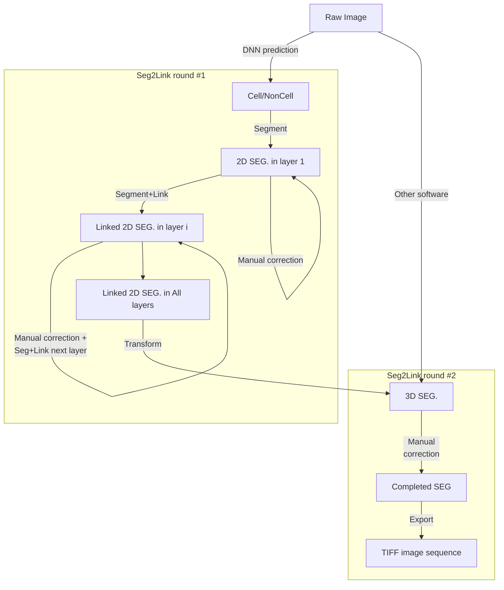

# Seg2Link

**Seg2Link** is a software designed to semi-automatically segment 3D EM images. 

## Features
- **Seg2Link** receives a cell/non-cell prediction image as input
  - The prediction can be made by other machine learning methods
  - Try our training program based on 2D U-Net
- **Seg2Link** is especially useful when the cell/non-cell prediction contains many mistakes.
  - The software will generate a segmentation based on the 
    inaccurate prediction and allows users to correct it. 
- **Seg2Link** allows users to perform several actions to correct the segmentation, 
    including *merging*, *division* and *deletion*. It also allows users to
  *undo* and *redo* these actions by multiple steps.
- **Seg2Link** allows users to easily *sort* the cells according to their sizes, 
  and *remove* those tiniest cells. It can also help users to locate each cell's position to 
  check the mistakes.
  
## Workflow


## Install
- Install [Anaconda](https://www.anaconda.com/products/individual) 
  or [Miniconda](https://conda.io/miniconda.html)
- Create a new conda environment and activate it by:
```console
$ conda create -n env-name python=3.8 pip
$ conda activate env-name
```
- Install seg2link:
```console
$ pip install seg2link
```

## Use the software
- Activate the created environment by:
```console
$ conda activate env-name
```
- Start the software
```console
$ seg2link
```
