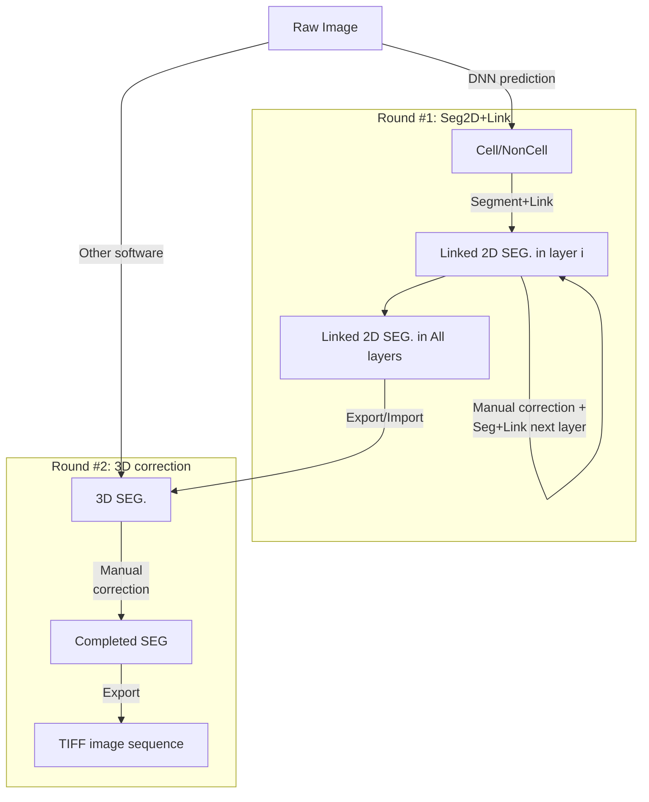

# 

**Seg2Link** is a software designed to semi-automatically segment cells in 3D image stacks, especially for the brain 
images obtained by electron microscopy. 

Read the documentation at [Seg2Link.io](https://wenchentao.github.io/Seg2Link/).

## Features
- **Utilize deep learning predictions** -- Seg2Link assist users to create to accurate segmentation results of individual cells from inaccurate cell/non-cell predictions .
- **Simplicity** -- Seg2Link generates segmentation automatically and allows for easy inspection and manual corrections.
- **Efficient** -- Seg2Link is designed for the fast processing of medium-sized 3D images with billions of voxels.
  
## Workflow


## Install
- During preparation

<!---
- Install [Anaconda](https://www.anaconda.com/products/individual) 
  or [Miniconda](https://conda.io/miniconda.html)
- Create a new conda environment and activate it by:
```console
$ conda create -n seg2link-env python=3.8 pip
$ conda activate seg2link-env
```
- Install seg2link:
```console
$ pip install seg2link
```
- Update to the latest version:
```console
$ pip install --update seg2link
```

## Use the software
- Activate the created environment by:
```console
$ conda activate seg2link-env
```
- Start the software
```console
$ seg2link
```
-->