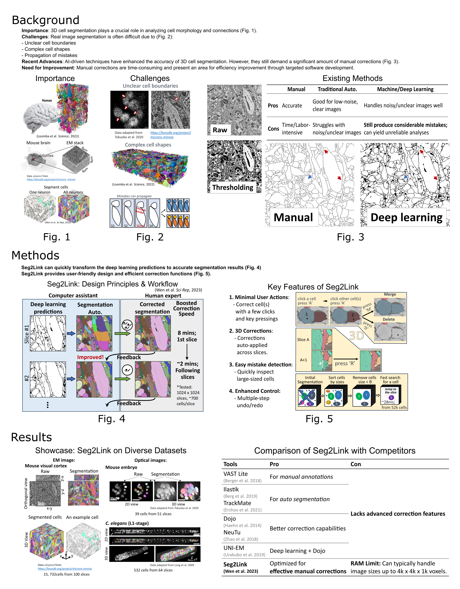

[](https://pypi.org/project/seg2link/) [](https://github.com/WenChentao/3DeeCellTracker/blob/master/LICENSE)

## 言語

- [English](README.md) | [中文](README_zh.md) | [日本語](README_jp.md)

# 

**Seg2Link** は [napari](https://napari.org) ベースのソフトウェアプログラムであり、特に電子顕微鏡で取得した脳組織の画像に対して、3Dイメージスタック内の細胞を半自動的にセグメントするように設計されています。

[ドキュメント](https://wenchentao.github.io/Seg2Link/) で使い方を学ぶことができ、また、[論文](https://doi.org/10.1038/s41598-023-34232-6) で詳細を読むことができます。

Seg2Link は、細胞/非細胞領域の予測を入力として必要とし、それらは [Seg2linkUnet2d](https://github.com/WenChentao/seg2link_unet2d) （[ドキュメント](https://wenchentao.github.io/Seg2Link/seg2link-unet2d.html)) で作成できます。

## 特徴
- **ディープラーニングの予測を利用する** -- Seg2Link は、不正確な細胞/非細胞の予測から個々の細胞の正確なセグメンテーション結果を作成するためにユーザーを支援します。
- **シンプル** -- Seg2Link は、セグメンテーションを自動的に生成し、簡単な検査と手動の修正を可能にします。
- **効率的** -- Seg2Link は、数十億のボクセルを持つ中規模な3D画像を高速に処理するように設計されています。

## 紹介


## インストール
- [Anaconda](https://www.anaconda.com/products/individual) または [Miniconda](https://conda.io/miniconda.html) をインストールします。
- 新しい conda 環境を作成し、それを有効にします：
```console
$ conda create -n seg2link-env python=3.8 pip
$ conda activate seg2link-env
```
- seg2link をインストールします：
```console
$ pip install seg2link
```
- 最新バージョンに更新します：
```console
$ pip install --upgrade seg2link
```

## ソフトウェアの使用
- 作成した環境を有効にします：
```console
$ conda activate seg2link-env
```
- ソフトウェアを起動します：
```console
$ seg2link
```

## 引用
このパッケージを研究で使用した場合は、以下を引用してください：

- Wen, C., Matsumoto, M., Sawada, M. et al. Seg2Link: an efficient and versatile solution for semi-automatic cell segmentation in 3D image stacks. _Sci Rep_ **13**, 7109 (2023). https://doi.org/10.1038/s41598-023-34232-6
