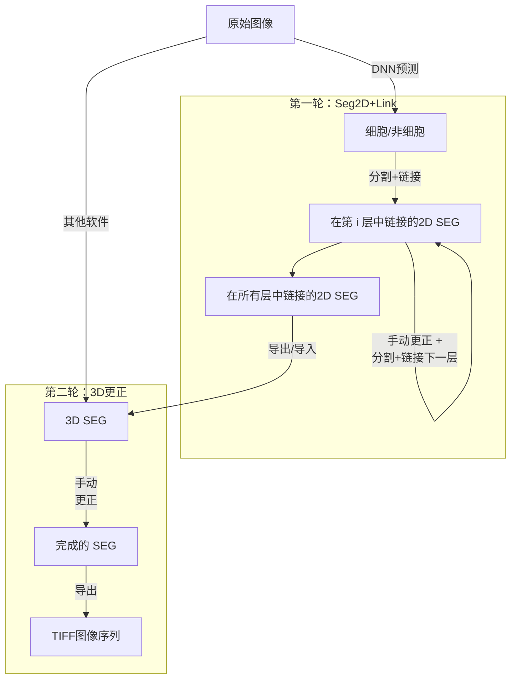

[](https://pypi.org/project/seg2link/) [](https://github.com/WenChentao/3DeeCellTracker/blob/master/LICENSE)

# 

**Seg2Link** 是一个基于 [napari](https://napari.org) 的软件程序，设计用于在3D图像堆栈中半自动地分割细胞，特别适用于通过电子显微镜获得的脑组织图像。

您可以通过 [在线教程](https://wenchentao.github.io/Seg2Link/) 了解如何使用它，或者阅读我们的 [论文](https://doi.org/10.1038/s41598-023-34232-6) 以获取更多细节.

Seg2Link 需要细胞/非细胞区域的预测作为输入，这些可以通过 [Seg2linkUnet2d](https://github.com/WenChentao/seg2link_unet2d) (参见 [在线教程](https://wenchentao.github.io/Seg2Link/seg2link-unet2d.html)) 创建。

## 特点
- **利用深度学习预测** -- Seg2Link 帮助用户从不准确的细胞/非细胞预测中创建准确的单细胞分割结果。
- **简单性** -- Seg2Link 自动生成分割，并允许轻松检查和手动更正。
- **高效性** -- Seg2Link 专为快速处理包含数十亿体素的中等大小的3D图像而设计。

## 工作流


## 安装
- 安装 [Anaconda](https://www.anaconda.com/products/individual) 或 [Miniconda](https://conda.io/miniconda.html)
- 创建并激活新的 conda 环境：
```console
$ conda create -n seg2link-env python=3.8 pip
$ conda activate seg2link-env
```
- 安装 seg2link：
```console
$ pip install seg2link
```
- 更新至最新版本：
```console
$ pip install --upgrade seg2link
```

## 使用软件
- 激活创建的环境：
```console
$ conda activate seg2link-env
```
- 启动软件：
```console
$ seg2link
```

## 引用
如果您在研究中使用了这个软件，请引用以下论文：
- Wen, C., Matsumoto, M., Sawada, M. et al. Seg2Link: an efficient and versatile solution for semi-automatic cell segmentation in 3D image stacks. _Sci Rep_ **13**, 7109 (2023). https://doi.org/10.1038/s41598-023-34232-6

