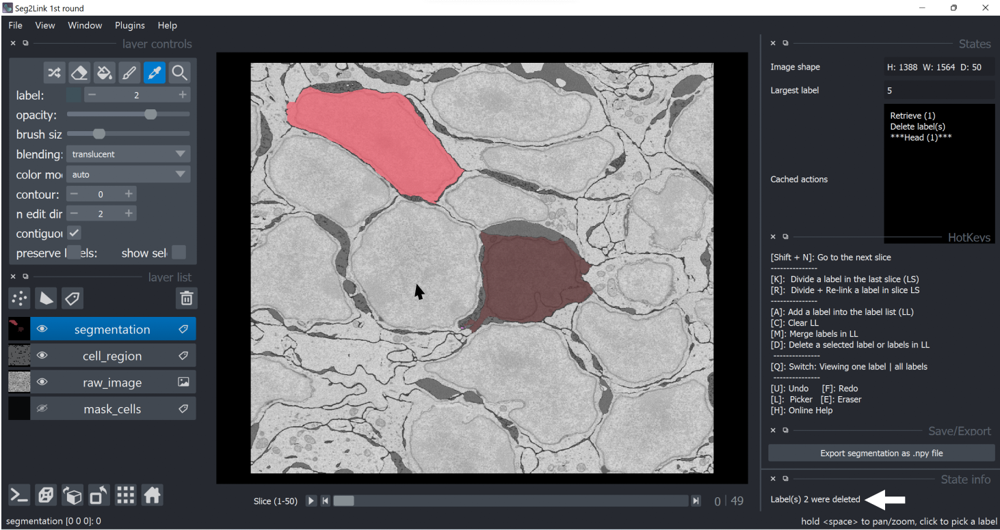

### *Delete*

#### Delete a single cell
1. Select a cell in **Pick Mode**. 
   
    

2. Press **D** to delete the selected cell.
   
    

#### Delete multiple cells
1. Select multiple cells and add them into the label list (See procedures 1 and 2 in [**Merge**](./merge.md) section)

    

2. Press **D** to delete the cells in the label list.
   
    

   **Note**: To clean the label list before deleting, press **C**.
