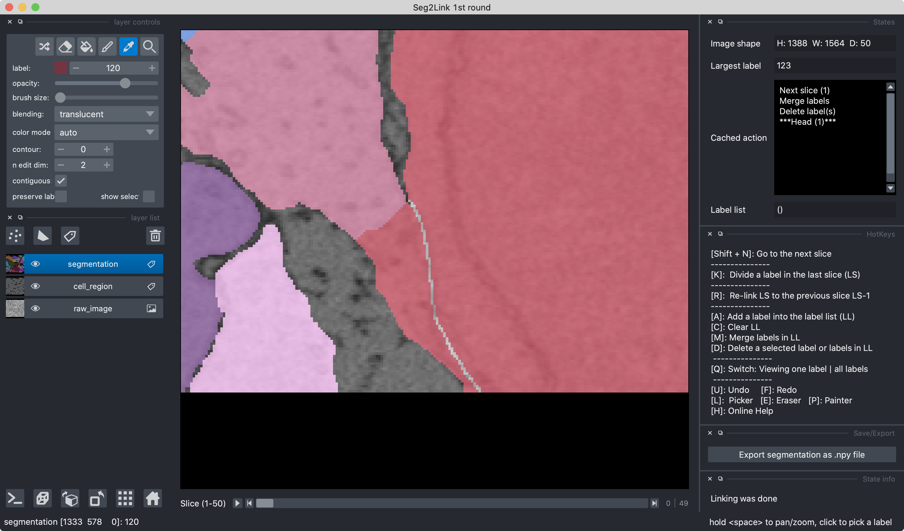

### *Division*

1. Select a cell in **Pick Mode** in the last slice i
   
    

2. If necessary, zoom in (**Space + Mouse scroll wheel**) and edit the cell boundary with the tool **Eraser**.
   
    

3. Press **K** to divide the cell in the slice i into multiple cells. 
   
    

4. If neccesary, use other commands such as **Merge** and **Delete** to further modify the result.
   
    
```
Notes:
- Division command should only be used in the last slice segmented. 
Apply it in previous slices is unsupported.
- The division will generate new cells which may require linkings.
```