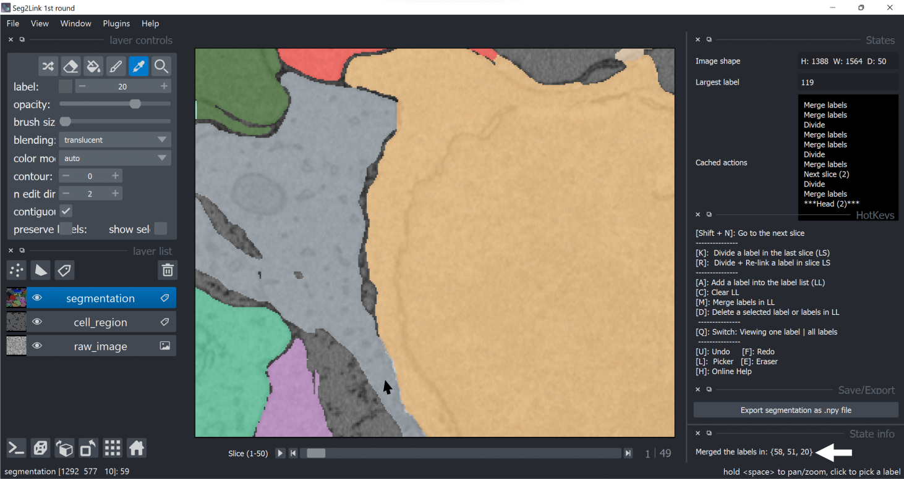

### *Division*

####Defination/Notes

- *Current working slice*: In Seg2D+Link Module, segmentation was generated and correctly sequentially.
 At a specific time point, the slice i and the previous slices have been segmented, while slices after i have not been processed yet. 
 We define the slice i as the current working slice.
- Because of the special data structure used in Seg2D+Link Module, the [Division]() and [Division+Relink](./divide_relink.md) can only be applied to current working slice. 
   
#### Procedures
1. Find a label that requires division, in the current working slice.
   
    

2. If necessary, zoom in (**Space + Mouse scroll wheel**) to view the details.
   
    

3. Select the tool **Eraser** by pressing **E**. Adjust the brush size. Then edit the cell boundary.

    

5. Switch to the **Picker Mode** by pressing **L**. Click the cell to be divided. Then press **K** to divide the cell in the slice into multiple *new* cells. 
   
    

6. If neccesary, use other commands such as [**Merge**](./merge.md) and [**Delete**](./delete.md) to further modify the result.
   
    
