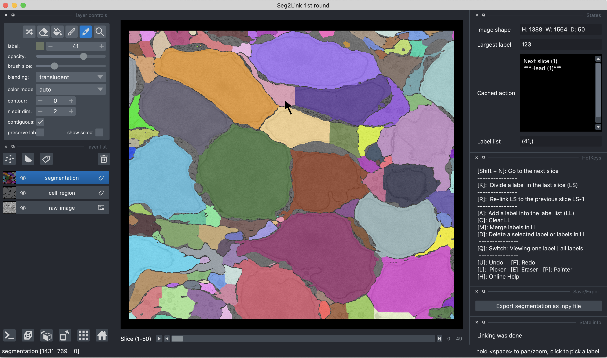
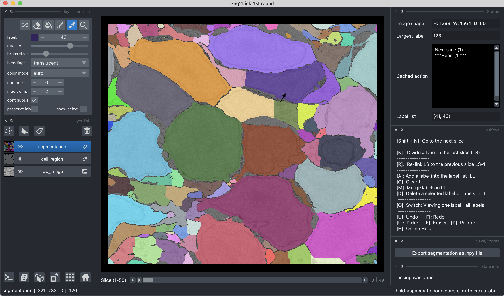
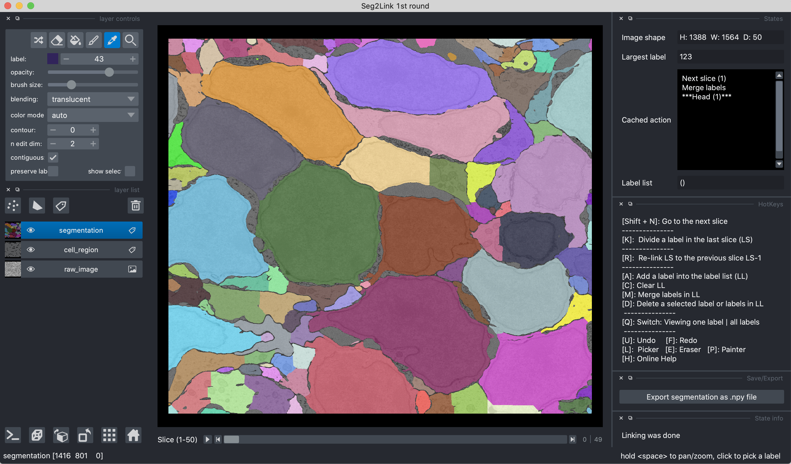

### *Merge cells*

1. Click a cell in **Pick Mode** to select it, and then press **A** to add the selected cell into the label list (Shown in the "states" panel).
   
    

2. Repeat step 1 to add more cells. 
   
    

3. Press **M** to merge the cells in the label list
   
    
   
   ```
   Note:
   - To clear the label list, press C.
   ```