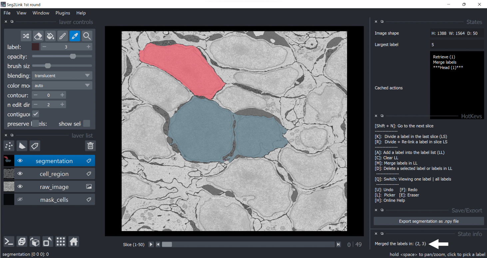

### *Merge cells*

1. In **Pick Mode**, click a cell with the left mouse button to select it. Then, press **A** to add the cell to the label list (in the *States* panel).
   
    

2. Repeat step 1 to add more cells. 
   
    

3. Press **M** to merge the cells in the label list
   
    

   **Note**: To clean the label list before applying merge, press **C**.
