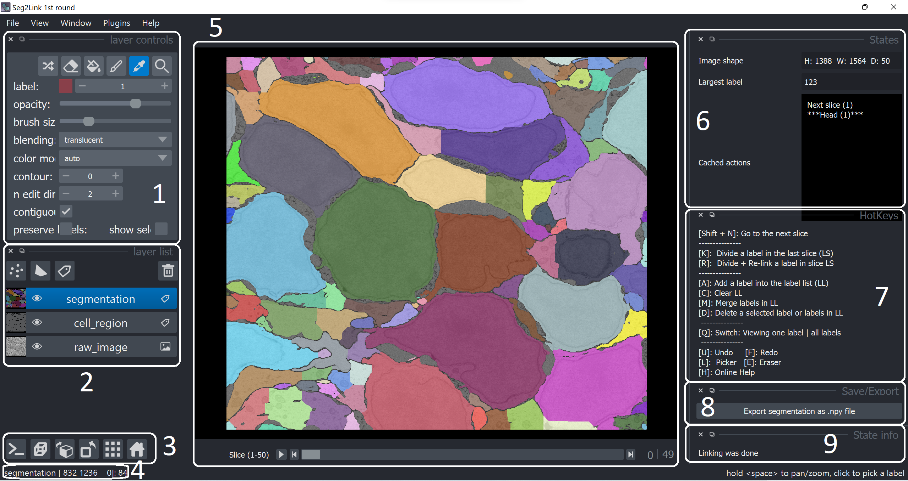

## Panels description

### Panels

### 1. Layer controls
This is a default panel in napari viewer for viewing/editing a label layer (segmentation layer).

Here are some key features:

- Picker mode: You can select a label by clicking it with mouse. Press L to change to this mode.
    - Pan/Zoom: You can hold space key and use left button/wheel of mouse to pan/zoom the image in Picker mode.
- Eraser: You can set a pixel as non-cell region (set the value to 0) with the eraser tool. Press E to change to this tool.
- Painter: You can paint a region with a specific label. Press P to change to this tool.
- Shuffle colors: Two neighboring cells can occasionally be assigned the same color. To shuffle the colors, press this button (top leftmost).

### 2. Layer list
You can select a layer from segmentation, cell/non-cell image, raw image, etc., and can hide or change the opacity of them.

### 3. Tools for change the view point
The most import function here is the "home" function (rightmost), which allows you to resize the image to see the entire image.

### 4. Current layer/cursor position/selected label
This panel is not used in this module, but it is useful in Module 3D correction.

### 5. Canvas (Segmentation results)
The segmentation results and other reference images are shown here.

- The slice number of the currently displayed one can be easily calculated using the information surrounding the slide bar.

    E.g, "Slice(1-50)" together with "12|49" indicate current slice number = 1 + 12 = 13.

### 6. States
Three types of information are shown here:

1. The size of the 3D image (based on the cell/non-cell image).
2. The largest cell number in current segmentation result.
3. The cached states that can be retrieved with undo/redo.

### 7. Hotkeys information
The (default) hotkeys used in Seg2D+Link module.

### 8. Export 
Export the 3D segmentation result.

### 9. Current state information
Show information of current state such like:

- The program is performing operation xxx;
- Operation xxx was finished;
- Warning message: xxx;
- etc.
