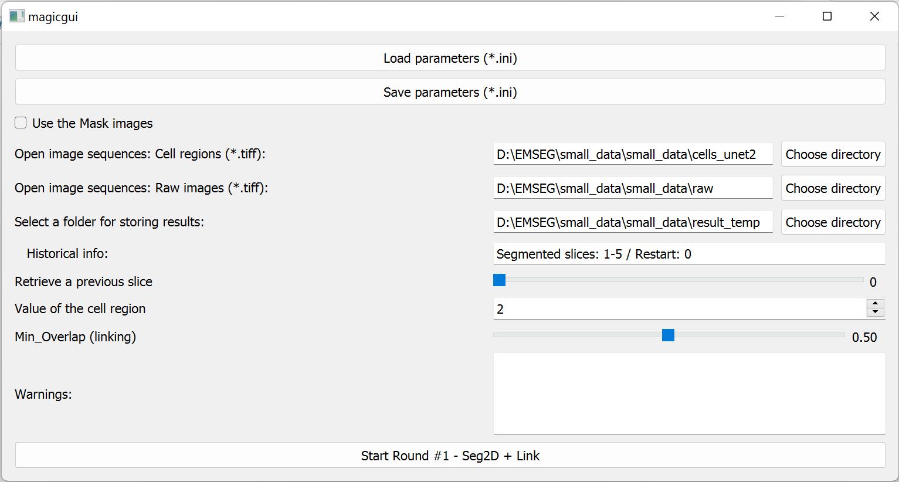

## Workflow of round 1

1. Specify the images and the parameters ([Detailed instructions](./parameter_setting.md))
     
    

2. Launch the main window of Seg2D+Link ([Panel descriptions](./panel_description.md))
   
    

3. Perform semi-automatic segmentations with following procedures:

      1. Correct the segmentation in slice **i** with following operations:
          - [*Merge*](./merge.md) / [*Delete*](./delete.md) / [*Division*](./divide.md) / [*Division-Relink*](./divide_relink.md).
      2. Generate automatic segmentation in the [*Next slice*](./next.md) **i**.
      3. Repeat 1 and 2 until all slices are segmented and linked.
      4. [*Export*](./export.md) the segmentation as a .npy file.