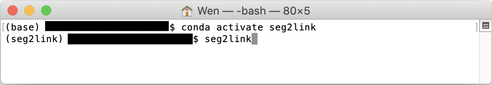

### *Start round 1*

1. Start Seg2Link from terminal
   
    

2. Choose the round 1
   
    

3. Set the parameters for round 1
   
    

4. Start the round 1
   
    

## Workflow in the first round

1. Correct the segmentation in slice **1**
2. Go to the next slice **i** (Press **Shift + N**)
3. Correct the segmentation in slice **i**
4. Repeat 2 and 3 until all slices are segmented
5. Export the segmentation as a .npy file (Press the Export button)