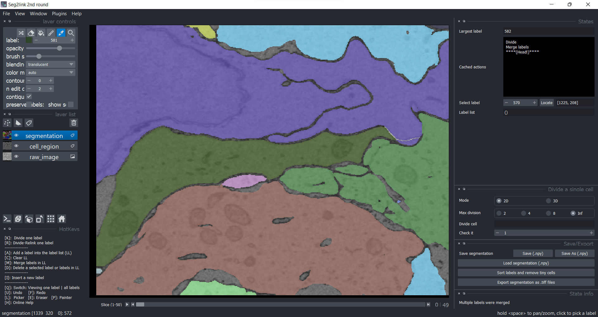

### Division (2D)

#### Division
1. The cell 76 in slice 1 should be divided into 3 cells.

    

2. Choose **2D mode** and max division = **Inf**. 

    Click the cell 76 in **Picker Mode**. Then press **K** to divide it. 
    

    - *The cell was over-segmented with 2D watershed algorithm.*

    - *If necessary, correct the cell boundary before pressing K*

4. Correct the over-segmentation by [Merge](./merge.md). 

    

#### Division+Relink

1. The cell 76 in slice 2 should be divided similarly as in slice 1.

    

2. Click the cell 76 in **Picker Mode**. Then press **R** to divide it and relink the results to slice 1. 

    

    *The over-segmentation was solved automatically by relinking.*

4. The cell 76 in slice 3.

    

    Similarly, press **R** solves everything. 

    
