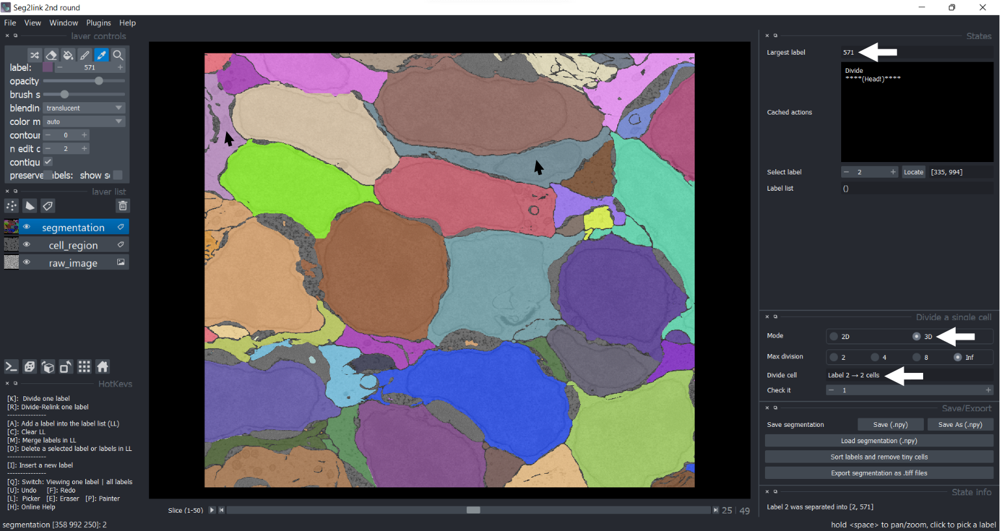
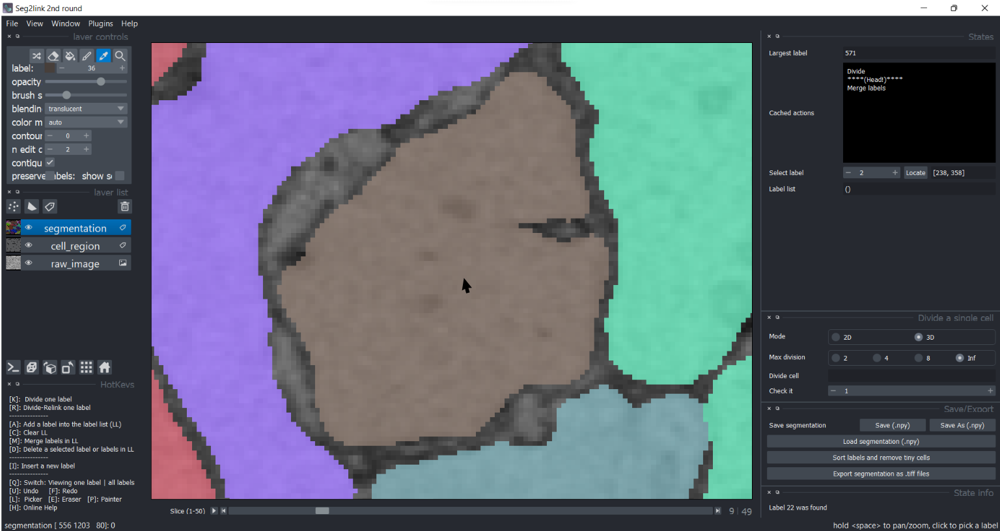
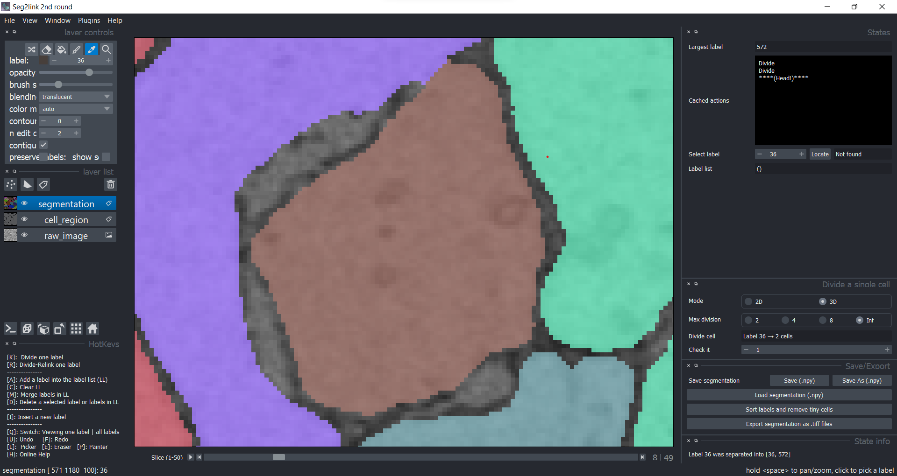
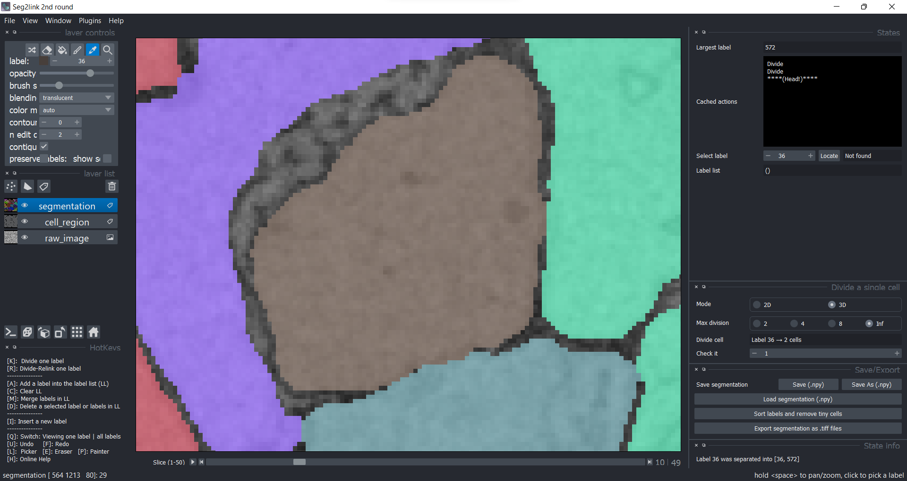

### Division (3D)

Divide a cell based on 3D connectivity. It should be used in following two cases:

#### Divide incorrect merged cells that are spatially separated
1. The cell 2 should be divided into two cells due to the careless incorrect merge operation by the user.

    

2. Choose **3D mode**. Click the cell 2 in **Picker Mode**. Then press **K** to divide it. 
    

    - *The cell was correctly divided into two cells.*

#### Divide two cells connected along z-axis
1. Here are three slices of cell 36. Suppose we need to divide it into two cells, with slice 10 as the boundary.

    Slice 9
    
    Slice 10
    
    Slice 11
    

2. Move to slice 10. Use bucket tool to fill the cell region with label 0 (i.e. as boundary)
    
    

4. Go back to slice 9. Click cell 36. Press K in 3D mode.

    Slice 9
    
    Slice 10
    
    Slice 11
    

    *The cell 36 has been divided into two cells along z-axis!*