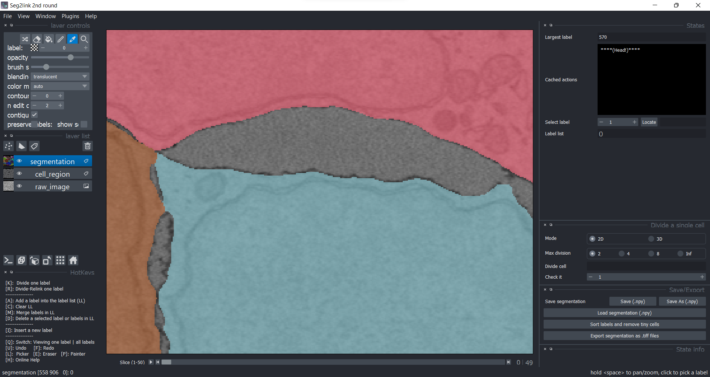

### Insert a cell

1. Suppose you want to paint a new cell in the background region.

    

2. Press **I**. 

    - The program will automatically switch to the **Painter mode** and create a new label, 571. 
    - Draw with the painter.

    

3. Similarly, move to slice 2. 

    

    And draw with the painter.
    

