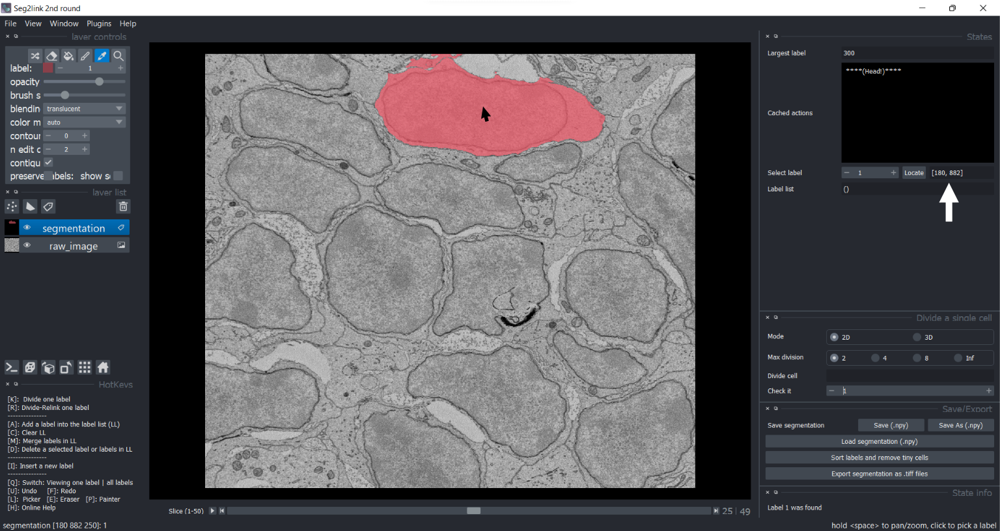
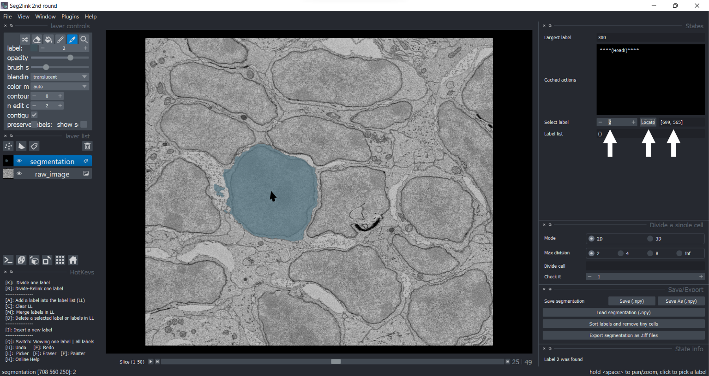

### Localize a cell

The example of the segmentation here has been performed [sort + remove tiny cells](./sort_remove.md#remove-tiny-cells).

1. Currently selected label = 1 (the largest cell). Press the button **Locate**.

    

    *The view jumps to the slice of the cell center*

2. Press **Q** to view the select label.

    

    - *The [x, y] coordinates of the cell center can be found after the ***Locate*** button.*
    - *The [x, y, z] coordinates of the cursor can be found at left-bottom.*
    - *This function helps users to find tiny cells.*

3. You can check another cell by modify the **Select label** and press **Locate** again.

    

    *Cell 2 is localized*

4. To view all cells, press **Q** again.

    