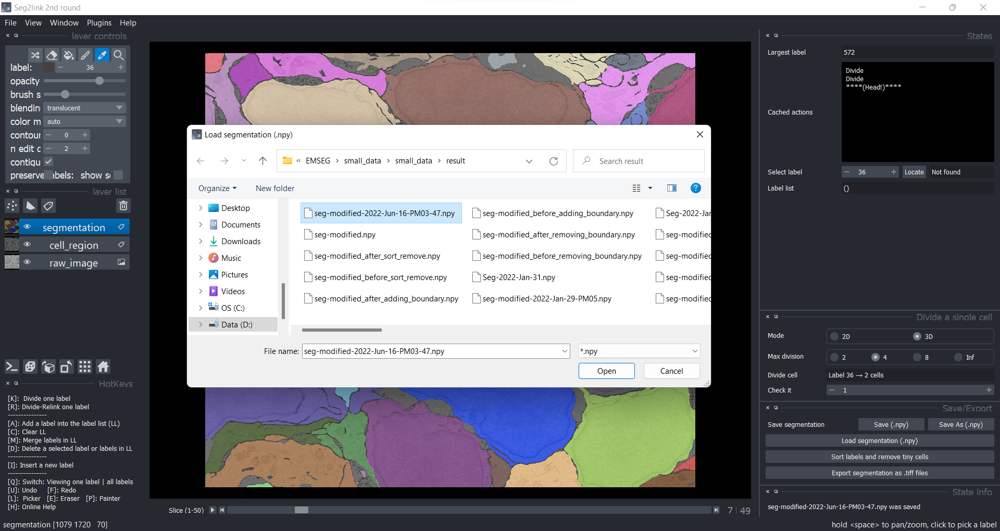

### Save/Load/Export

#### Save/Load
Because saving the temporal result is time-consuming in 3D correction, the program does not save it automatically.

##### Save
When you have finished a certain number of corrections in the 3D correction module, press the ***Save*** button. The program will save the current result as "seg-modified.npy."

##### Save as
When you need to save the segmentation with a different filename, click the ***Save as*** button

##### Load
When you need to load a segmentation result saved previously, click the ***Load segmentation*** button and choose the file you need.

#### Export
To export the result, click the ***Export*** button and then select a folder. The program will create a sub-folder called "seg-tiff" in which the exported 2D Tiff images will be saved.
