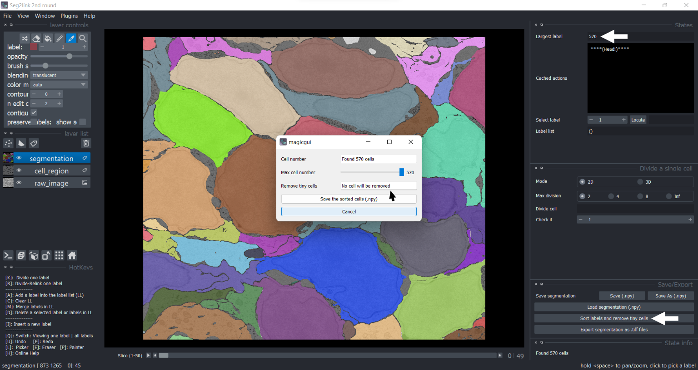
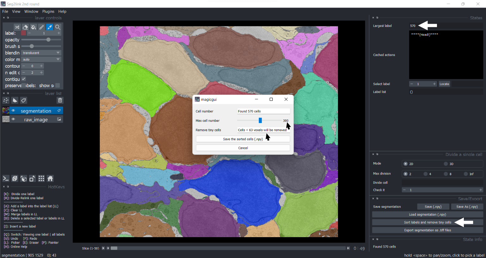

### Sort and remove tiny cells

#### Sort cells
1. Press the button "Sort labels and remove tiny cells". 

    

    *Do not adjust the slide bar "Max cell number", unless you want to [*remove tiny cells*](#remove-tiny-cells).*

2. Press the button "Save the sorted cells (.npy)".

    
    ***The labels have been sorted according to their sizes!!***

#### Remove tiny cells
1. Press the button "Sort labels and remove tiny cells", and adjust the "Max cell number".

    
    ***The cells < 63 voxels will be removed!***

2. Press the button "Save the sorted cells (.npy)".

    

    ***Only 300 sorted larger cells were kept!!*** 

    *You can inspect these larger cells with [*Localization*](./localize.md)*

#### Notes: How to go back
- After applying sorting/removing operation, the cache of the actions will be reset. Users cannot use undo/redo to cancel the operation.
- Instead, the segmentations before/after the operation are automatically saved as two files:
    - seg-modified_before_sort_remove.npy
    - seg-modified_after_sort_remove.npy
- If users are unsatisfied with the result, retrieve the previous state with [Load](./save_load_export.md#load) function.
